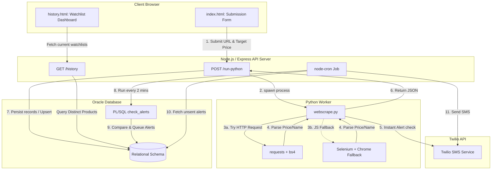
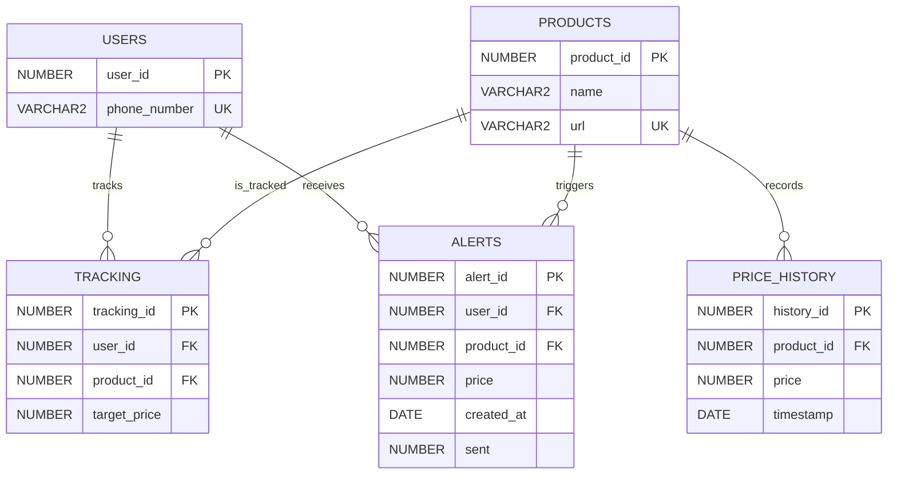

# Sale Alert System

A highly resilient, real-time price tracking and notification system designed to monitor product prices on Amazon, Flipkart, and eBay. Users can paste a product URL or input a search query alongside a target price. The system periodically checks product prices and sends an SMS notification using Twilio the moment a target price is met or dropped below.

This project is built using a modern decoupled architecture combining a **Node.js/Express web server**, an autonomous **Python scraping worker** (supporting standard HTML parsing and a headless Selenium fallback), and an **Oracle Database** instance for storing relational entities, price histories, and transaction alerts.

---

## Architecture & System Design

The system is split into three primary layers: the Frontend Client, the Express API Server (which manages database state and coordinates cron execution), and the Python Web Scraper.



### Core Workflows

#### 1. Request Flow (Product Onboarding & Immediate Check)
1. **Submit**: A user submits a product URL or plain-text query (e.g., `amazon mechanical keyboard`), a target price, and a mobile number from the frontend (`/index.html`).
2. **Execute**: The server (`server.js`) spawns a child process executing `webscrape.py` with the inputs.
3. **Scrape**:
   - `webscrape.py` automatically detects the marketplace (Amazon, Flipkart, eBay, or general search queries).
   - Attempts a lightweight fetch using `requests` and parses content with `BeautifulSoup`.
   - If static parsing fails (common due to client-side JS rendering or anti-scraping blocks), it falls back to a headless **Selenium Chrome** instance to wait for visual elements.
4. **Immediate Alert Check**: If the scraped price is already at or below the target price, `webscrape.py` triggers an immediate Twilio SMS send to the user's phone.
5. **Persist**: The worker prints the parsed data to stdout. `server.js` parses the JSON output and updates the database using transaction hooks:
   - **User**: Merged/upserted by phone number.
   - **Product**: Inserted or loaded by URL.
   - **Price History**: Inserts a new timestamped observation.
   - **Tracking**: Inserts or updates the target price criteria.

#### 2. Alert Flow (Background Cron Evaluation)
1. **Schedule**: A `node-cron` runner executes every 2 minutes on the server.
2. **Evaluate**: It calls the PL/SQL stored procedure `check_alerts`.
   - `check_alerts` cursor-scans the `tracking` table.
   - Fetches the most recent price observation for each product from `price_history`.
   - Inserts records into the `alerts` queue with `sent = 0` if the current price is less than or equal to the target price.
3. **Dispatch**: The Express server queries the database for all `sent = 0` alerts.
4. **Notify**: For each pending alert, it sends a formatted Twilio SMS containing the product name, target price reached, and purchase link.
5. **Acknowledge**: Updates the alert status in the database to `sent = 1` to prevent duplicate notification dispatches.

---

## Tech Stack

| Layer | Component / Package | Purpose |
| :--- | :--- | :--- |
| **Server Engine** | Node.js (v18+) | Core runtime environment |
| **API Framework** | Express 5 | Handles routing, static assets, and sub-process spawning |
| **Task Scheduler** | `node-cron` | Schedules recurrent alert logic every 2 minutes |
| **Scraper Worker** | Python 3 (3.9+) | Core scraper engine |
| **HTML Parser** | BeautifulSoup4 | Performs fast, static DOM parsing |
| **Browser Automation** | Selenium (WebDriver Chrome) | Heavy JavaScript rendering fallback |
| **Database** | Oracle Database (19c/21c) | Storage, relational modeling, and procedures |
| **Node Database Client** | `oracledb` | Connects Node.js to the Oracle DB instance |
| **Python Database Client** | `python-oracledb` | Connects Python scripts directly to Oracle DB |
| **Messaging Channel** | Twilio SMS REST API | Handles global SMS alert delivery |
| **Frontend UI** | Vanilla HTML, CSS, JavaScript | Interactive user interface |

---

## File Structure

```directory
.
├── server.js                 # Express server, REST endpoints, database sync, cron scheduler
├── webscrape.py              # Autonomous Python CLI tool for page scraping and direct alerts
├── package.json              # Node.js app dependencies and script entrypoints
├── package-lock.json         # Pinned npm dependencies tree
├── saved_input.txt           # File containing sample inputs for manual debugging/testing
├── database/                 # Relational Database scripts and configurations
│   ├── schema.sql            # Main database tables structure definitions
│   ├── sequences.sql         # Sequences for PK generation (user, product, tracking, history, alert)
│   ├── procedures.sql        # check_alerts PL/SQL procedure execution logic
│   └── cleanup.sql           # Schema purge script (drops tables and sequences safely)
└── public/                   # Client web assets
    ├── index.html            # Tracking submission dashboard with dark-theme glassmorphism UI
    └── history.html          # Interactive tracking history, split into Amazon & Flipkart components
```

---

## Database Design & Relational Schema

The database utilizes five relational tables inside Oracle. PK generation utilizes Oracle database sequences to support transactional insertions.



### Table Definitions

1. **`users`**: Maintains registered recipients.
   * `user_id` (`NUMBER`): Primary key.
   * `phone_number` (`VARCHAR2(15)`): Unique recipient phone number.
2. **`products`**: Cached product catalog metadata.
   * `product_id` (`NUMBER`): Primary key.
   * `name` (`VARCHAR2(300)`): Extracted item description.
   * `url` (`VARCHAR2(1000)`): Unique index matching target store product link.
3. **`tracking`**: Intersect entity storing price trigger thresholds.
   * `tracking_id` (`NUMBER`): Primary key.
   * `user_id` (`NUMBER`): Foreign key pointing to `users`.
   * `product_id` (`NUMBER`): Foreign key pointing to `products`.
   * `target_price` (`NUMBER`): The target price threshold.
   * *Constraints*: Unique combination of `user_id` and `product_id`.
4. **`price_history`**: Historic dataset of observed prices.
   * `history_id` (`NUMBER`): Primary key.
   * `product_id` (`NUMBER`): Foreign key pointing to `products`.
   * `price` (`NUMBER`): Measured price numeric amount.
   * `timestamp` (`DATE`): Recorded date and time.
5. **`alerts`**: Alert staging queues for messaging dispatches.
   * `alert_id` (`NUMBER`): Primary key.
   * `user_id` (`NUMBER`): Foreign key pointing to `users`.
   * `product_id` (`NUMBER`): Foreign key pointing to `products`.
   * `price` (`NUMBER`): Price level recorded at target trigger point.
   * `created_at` (`DATE`): Trigger creation date.
   * `sent` (`NUMBER`): Flags delivery status (`0` = Pending, `1` = Sent).

---

## Detailed REST API Documentation

### 1. `POST /run-python`
Initiates a synchronous scrape attempt for the product input, creates database relations, and checks for initial target matches.

* **Request Headers**: `Content-Type: application/json`
* **Request Payload**:
```json
{
  "user_input": "https://www.amazon.in/dp/B0D5D1C111",
  "target_price": 1499.00,
  "phone_number": "+919876543210",
  "currency": "INR"
}
```
* **Response Payload (Success)**:
```json
{
  "success": true,
  "price": 1399.00,
  "message": "SMS sent: SMxxxxxxxxxxxxxxxxxxxxxxxx",
  "sent_sms": true
}
```
* **Response Payload (Above Target)**:
```json
{
  "success": true,
  "price": 1699.00,
  "message": "Price (1699.0) is above target (1499.0); no SMS sent.",
  "sent_sms": false
}
```

### 2. `GET /history`
Returns a unified listing of all active product trackings along with the most recent price observation.

* **Request Headers**: None
* **Response Payload**:
```json
[
  {
    "url": "https://www.amazon.in/dp/B0D5D1C111",
    "name": "Mechanical Gaming Keyboard RGB Backlit",
    "price": 1699.00,
    "target": 1499.00
  },
  {
    "url": "https://www.flipkart.com/product-link-placeholder",
    "name": "Wireless Bluetooth Earbuds Pro",
    "price": 999.00,
    "target": 999.00
  }
]
```

---

## Setup & Local Installation

Follow these steps to set up and run the system locally.

### Prerequisites
- **Node.js** (v18.x or later)
- **Python** (v3.9 or later)
- **Oracle Database Instance** (Reachable local installation, Docker container, or Oracle Cloud Autonomous DB)
- **Google Chrome** & matching **ChromeDriver** installed (required for Selenium headless operation)
- A **Twilio Developer Account** with an active, SMS-enabled virtual phone number

### Step 1: Clone & Install Dependencies
Install required packages for the Node.js Express server:
```bash
npm install
```

Install requirements for the Python scraper subsystem:
```bash
pip install oracledb requests beautifulsoup4 python-dotenv twilio selenium
```

### Step 2: Set Up Database Entities
Execute the SQL scripts against your Oracle Database instance in order. You can run these using SQLcl, SQL*Plus, or any visual tool like SQL Developer.

```bash
# 1. Sequences initialization
sqlplus user/password@connect_identifier @database/sequences.sql

# 2. Tables setup
sqlplus user/password@connect_identifier @database/schema.sql

# 3. Procedures registration
sqlplus user/password@connect_identifier @database/procedures.sql
```

> [!NOTE]
> If you ever need to clean and reset the database instance schema, run:
> ```bash
> sqlplus user/password@connect_identifier @database/cleanup.sql
> ```

### Step 3: Configure Environment Variables
Create a file named `.env` in the root directory:
```env
# Database Credentials
DB_USER=your_oracle_db_username
DB_PASSWORD=your_oracle_db_password
DB_CONNECT=your_host_address:1521/your_service_name

# Twilio API Configuration
TWILIO_ACCOUNT_SID=ACXXXXXXXXXXXXXXXXXXXXXXXXXXXXXXXX
TWILIO_AUTH_TOKEN=your_twilio_auth_token
TWILIO_FROM_NUMBER=+12345678901
```

### Step 4: Run the Application
Start the Node.js application server:
```bash
npm start
```
By default, the server starts on port `3000`. Navigate to `http://localhost:3000` to access the application dashboard.

---

## Scraper Subsystem Details (`webscrape.py`)

The scraper uses a layered extraction flow.

```
                  [Input: URL or Query]
                            │
                            ▼
               [Detect site / Build URL]
                            │
            ┌───────────────┼───────────────┐
            ▼               ▼               ▼
        [Amazon]       [Flipkart]        [eBay]
            │               │               │
            └───────────────┬───────────────┘
                            │
             [Lightweight requests.get Fetch]
                            │
                            ▼
            [Check if Price extracted successfully?]
                   /                 \
                 YES                  NO
                 /                     \
       [Set Price details]      [Spawns Headless Selenium]
                                        │
                                        ▼
                             [Wait for Selector render]
                                        │
                                        ▼
                             [Extract Price & Details]
```

### Selectors Registry
Marketplace selectors are maintained dynamically in target parsing maps:

* **Amazon**:
  * *Price*: `span.a-price > span.a-offscreen`, `.a-price-whole`, `#priceblock_ourprice`, `#priceblock_dealprice`
  * *Title*: `#productTitle`, `span#productTitle`, `h1#title`, `h1`
* **Flipkart**:
  * *Price*: `.Nx9bqj.CxhGGd`, `div._30jeq3._1_WHN1`, `div._30jeq3`, `span._30jeq3`
  * *Title*: `.VU-ZEz`, `._35KyD6`, `span.B_NuCI`
* **eBay**:
  * *Price*: `.ux-textspans`, `.s-item__price`, `.ux-price`
  * *Title*: `h1[itemprop='name']`, `.ux-layout-section__title`, `.it-ttl`

---

## Known Limitations

- **No Periodic Re-scraping**: The Express cron scheduler calls the `check_alerts` PL/SQL procedure, which evaluates price metrics already recorded inside `price_history`. However, price checks only happen when a user manually enters a product URL on the website. Thus, background price updates are not continuous.
- **Fragile CSS Selector Parsing**: Web scrapers depend heavily on static markup components. When Amazon, Flipkart, or eBay update their stylesheet structures, scraping selectors must be manually updated.
- **Selenium Resource Consumption**: Launching Chrome web driver elements headlessly is memory-intensive and may cause resource constraints under high concurrent requests.
- **Authentication & Security**: The API currently lacks authentication blocks. Input fields are not sandboxed against aggressive API execution.

---

## Future Improvements

1. **Background Re-scraping Scheduler**: Introduce a background process queue that fetches new price values for all active products from `tracking` on a daily or hourly basis.
2. **Robust Content Extraction**: Integrate JSON-LD structured schema parsing (`application/ld+json`) which provides a standard format across e-commerce networks.
3. **Queue Orchestration**: Transition the Python execution flow into a message-based queuing service (such as BullMQ or RabbitMQ) to process checks asynchronously.
4. **Enhanced UI Features**: Add SVG charts representing the historical fluctuation of prices over time on the `/history.html` dashboard.
